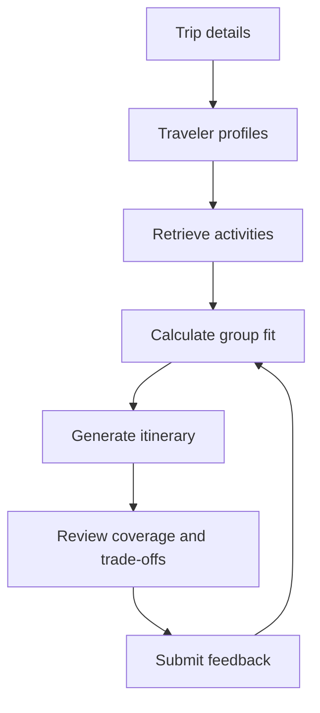

# TripSync

> An AI-powered group travel planner that balances traveler preferences, constraints, and interests.

## Project status

TripSync now has a working **preference, retrieval, and recommendation flow**. It
collects validated group preferences, retrieves grounded destination activities,
ranks them with an explainable group-fit formula, identifies must-dos, and lets the
organizer maintain a shortlist. Itinerary generation is the next major product
phase.

## The problem

Planning a group trip is difficult because travelers often have different interests,
budgets, mobility needs, food restrictions, and preferred travel pace. The organizer
usually collects this information informally and then tries to create a plan that
keeps everyone happy.

TripSync aims to make that process more transparent. It will collect traveler
preferences, retrieve suitable activities, measure how well each option fits the
group, and generate an itinerary that explains its choices and trade-offs.

## Version 1 scope

The first version will allow an organizer to:

1. Enter a destination, trip length, budget, and preferred pace.
2. Add profiles for two to six travelers.
3. Record interests, walking tolerance, food restrictions, and must-do activities.
4. Retrieve and rank relevant activities for the destination.
5. Generate a one-to-five-day itinerary.
6. See why each activity was selected and which travelers it serves.
7. reject an activity as too expensive, too demanding, or uninteresting.
8. Regenerate the affected day using that feedback.

The MVP will not include booking, live prices, flight or hotel search, payments,
real-time availability, or route optimization.

## Planned user flow



## What makes TripSync different

TripSync is designed around **group preference balancing**, rather than producing a
generic list of popular attractions.

For each candidate activity, the application will consider:

- interest match across travelers;
- walking and accessibility compatibility;
- budget compatibility;
- trip pace and time constraints;
- food restrictions where relevant;
- must-do preferences;
- fairness, so one traveler does not dominate the itinerary.

The UI will display both a group-fit score and a traveler coverage explanation.
The initial deterministic formula is documented in
[docs/scoring.md](docs/scoring.md), and the text-retrieval boundary is documented in
[docs/retrieval.md](docs/retrieval.md).

## Initial technical approach

| Layer | Initial choice |
|---|---|
| User interface | Streamlit |
| Application logic | Python |
| Data validation | Pydantic |
| Activity data | Structured JSON |
| Retrieval | Text search first; vector and hybrid search later |
| Group-fit ranking | Rule-based scoring |
| Itinerary generation | OpenAI API |
| Evaluation | Retrieval metrics and itinerary-quality checks |
| Feedback | Local structured log first; database later |

The tools may change as the project develops. The initial goal is to validate the
complete planning flow before adding infrastructure.

## Project structure

```text
TripSync/
├── app.py
├── README.md
├── requirements.txt
├── .env.example
├── .gitignore
├── data/
│   └── README.md
├── docs/
│   └── data-schema.md
├── evaluation/
│   └── README.md
├── monitoring/
│   └── README.md
├── notebooks/
│   └── README.md
├── src/
│   ├── __init__.py
│   ├── models.py
│   ├── planner.py
│   ├── prompts.py
│   ├── scoring.py
│   └── search.py
└── tests/
    └── README.md
```

## Data model

The first dataset will contain structured activity records. Each record will include
fields such as:

```json
{
  "id": "rome_vatican_museums",
  "name": "Vatican Museums",
  "city": "Rome",
  "country": "Italy",
  "category": "museum",
  "interests": ["art", "history", "religion"],
  "walking_level": "high",
  "budget_level": "moderate",
  "duration_hours": 3.0,
  "indoor": true,
  "family_friendly": true,
  "accessibility_notes": "A large venue with substantial walking.",
  "reservation_required": true,
  "description": "A major art and history museum complex.",
  "source_url": "https://example.com"
}
```

See [docs/data-schema.md](docs/data-schema.md) for the planned schema.

## Evaluation plan

### Retrieval evaluation

TripSync will use a ground-truth dataset of travel requests and relevant activities.
The project will compare:

- text search;
- vector search;
- hybrid search;
- optional reranking.

The primary metrics will be Hit Rate and Mean Reciprocal Rank (MRR).

### Itinerary evaluation

Generated plans will be evaluated for:

- hard-constraint compliance;
- traveler preference coverage;
- fairness across the group;
- realistic daily pace;
- grounding in retrieved activity data;
- clarity of explanations and trade-offs.

### Feedback and monitoring

The application will record user feedback categories, response time, retrieval
results, and itinerary-generation metadata. This will support later analysis of
rejected recommendations and common planning failures.

## Local setup

These commands prepare the environment and start the working Streamlit application:

```bash
python -m venv .venv
source .venv/bin/activate
pip install -r requirements.txt
cp .env.example .env
streamlit run app.py
```

Add your API key to `.env`. Never commit the `.env` file.

## Development roadmap

- [x] Define the problem and MVP scope
- [x] Create the initial repository structure
- [x] Define the activity-data schema
- [x] Create the first sample activity dataset
- [x] Build traveler and trip input models
- [x] Implement group-fit scoring
- [x] Build the first Streamlit preference form
- [x] Add text retrieval
- [ ] Generate a grounded itinerary
- [ ] Add activity rejection and day regeneration
- [ ] Evaluate retrieval approaches
- [ ] Evaluate itinerary quality
- [ ] Add monitoring and persistent storage
- [ ] Add Docker configuration and deployment instructions

## LLM Zoomcamp alignment

TripSync is being developed as an end-to-end LLM application. The planned work
includes a documented problem, a searchable knowledge source, retrieval and LLM
evaluation, an interactive interface, user feedback, monitoring, and
containerization.

## License

A license has not been selected yet.
