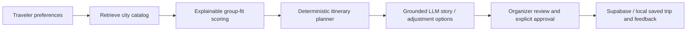

# TripSync

TripSync is an AI-assisted group travel planner. It turns a group's interests,
walking comfort, budget, food needs, pace, and must-dos into explainable activity
recommendations and a reviewable itinerary.

It is built as an end-to-end LLM application for the LLM Zoomcamp project: a
curated knowledge base is retrieved first, deterministic logic makes the planning
decisions, and an LLM adds grounded narration and adjustment ideas under a strict
structured-output contract.

## What it does

- Collects validated preferences for 2–6 travelers and trips of 1–5 days.
- Retrieves from a curated catalog for Rome, Florence, Milan, and Naples using
  text, vector, or hybrid retrieval.
- Scores activities for shared interests, walking and budget fit, must-dos, and
  fairness across the group.
- Shows Top 5, must-do, all, and rejected activity views; users can manage a
  shortlist before generating the itinerary.
- Builds a deterministic itinerary with daily pace, duration, transition, and
  duplicate-prevention rules.
- Lets the organizer reject, replace, or add activities. Recommendations that
  exceed the pace limit require explicit confirmation and remain visibly marked
  as over pace.
- Uses the OpenAI Responses API only for a grounded itinerary story and
  organizer-approved adjustment options; the LLM cannot silently change a plan.
- Saves trips, LLM feedback, and overall-plan ratings to Supabase when it is
  configured; SQLite is the local-development fallback.
- Includes an admin-protected feedback dashboard with five privacy-safe charts
  and JSON export.

## How the system works



The LLM receives only the validated trip, eligible catalog records, and current
plan. Pydantic schemas plus deterministic grounding validation reject invented
activity IDs, duplicate stops, moved activities, and invalid output structures.
Read the full RAG boundary in [docs/rag.md](docs/rag.md).

## Local setup

Requires Python 3.12 or later.

```bash
python -m venv .venv
source .venv/bin/activate
pip install -r requirements.txt
cp .env.example .env
streamlit run app.py
```

Set `OPENAI_API_KEY` in `.env` to enable trip stories and LLM adjustment ideas.
The deterministic recommendation and itinerary flow works without making an API
call. Never commit `.env` or `.streamlit/secrets.toml`.

### Shared persistence and feedback dashboard

For shared persistence, create a Supabase project, run
[`supabase/schema.sql`](supabase/schema.sql) once in its SQL Editor, then add
these server-only values to `.env` locally and your Streamlit Cloud secrets in
production:

```bash
SUPABASE_URL=https://your-project.supabase.co
SUPABASE_SECRET_KEY=your-server-side-secret
TRIPSYNC_ADMIN_PASSWORD=choose-a-dashboard-password
```

The first two values store saved trips, feedback, and the shared activity catalog
server-side. The dashboard password protects **Feedback insights** and **Curate
catalog**. Without Supabase credentials, TripSync uses the local SQLite fallback
in `data/`.

Saved plans are deliberately scoped to the current anonymous browser session.
That prevents one public visitor from seeing another visitor's plans. Supporting
the same person's history across devices would require an authentication step.

## Run with Docker Compose

Docker Compose starts the complete local app and retains the local SQLite
fallback state in a named volume. It also forwards any optional OpenAI,
Supabase, and dashboard variables from `.env`.

```bash
cp .env.example .env
docker compose up --build
```

Open <http://localhost:8501>. Stop it with `Ctrl+C`; add `-d` to run it in the
background. Remove the local fallback volume only when you intentionally want
to erase it:

```bash
docker compose down --volumes
```

## Run with Docker

Build the image (the semantic retrieval model is downloaded during the build):

```bash
docker build -t tripsync .
```

Run it with an OpenAI key and a named volume for the local fallback state:

```bash
docker run --rm -p 8501:8501 \
  --env-file .env \
  -v tripsync-state:/app/state \
  tripsync
```

Open <http://localhost:8501>. The catalog is included in the image; the mounted
`tripsync-state` volume stores only SQLite fallback state. On a hosted platform,
set `OPENAI_API_KEY` (and optionally `OPENAI_MODEL`, Supabase credentials, and
the dashboard password) through that platform's secrets manager, never in the
repository.

## Evaluation

From an activated virtual environment:

```bash
# Retrieval: text, vector, and hybrid on the same labeled cases
python -m evaluation.retrieval --compare

# Deterministic itinerary constraints, grounding, coverage, and fairness
python -m evaluation.itinerary

# 20 LLM contract fixtures, with no API cost
python -m evaluation.llm

# Optional paid robustness run against held-out prompts
python -m evaluation.llm --cases evaluation/llm_holdout_cases.json --live

# Full test suite
python -m unittest discover -s tests -q
```

The current retrieval and itinerary baseline results are documented in
[evaluation/README.md](evaluation/README.md). The 20 contract cases and 12
held-out LLM robustness cases measure schema compliance, grounding,
completeness, and proposal applicability—not subjective travel-writing quality.

## Data and curation

`data/activities.json` is the local seed and fallback for the validated activity
catalog. When Supabase is configured, the first catalog access seeds its shared
`catalog_activities` table from this file; future additions and deletions persist
there across Streamlit Cloud restarts. Raw external candidate imports remain
under `data/candidates/` for review. The curation rules are in
[docs/curation-standard.md](docs/curation-standard.md), and retrieval behavior
is in [docs/retrieval.md](docs/retrieval.md).

### Batch curation

The **Curate catalog** workspace supports a fast human-in-the-loop workflow:
it filters the published catalog by country and city, bulk-adds safe
Pydantic-validated drafts from a candidate batch, and bulk-deletes selected
records only after confirmation. Hotels, airports, transport stations, and
untyped records are automatically excluded from bulk promotion.

The same workflow is available as a script. It fetches source candidates and
prepares a review batch without changing the catalog by default:

```bash
python -m src.catalog_batch --city Venice --country Italy --limit 50
```

After reviewing the candidate file or the Curation workspace, explicitly
publish the batch with:

```bash
python -m src.catalog_batch --city Venice --country Italy --limit 50 --apply
```

This is deliberate: automation prepares and validates many records at once,
but it does not silently claim that a place is currently open, accessible, or a
good fit for every traveler.

### Scheduled candidate retrieval

The project also includes a `dlt` ingestion pipeline and weekly GitHub Actions
workflow. Its versioned popular-destination queue starts with Italian cities,
Paris, Barcelona, London, Kyoto, and New York City. It retrieves raw Wikidata
candidates, records local provenance in DuckDB, and opens a review pull request.
It does **not** publish activities automatically. The weekly workflow rotates
through three active destinations; a manual run processes the entire queue.

```bash
python -m src.catalog_dlt --limit 50
```

See [docs/catalog-ingestion.md](docs/catalog-ingestion.md) for the human review
step and how to run a different country.

## Live demo and project evidence

- **Public demo:** [tripsync.streamlit.app](https://tripsync.streamlit.app/)
- **RAG boundary:** [docs/rag.md](docs/rag.md)
- **Catalog curation standard:** [docs/curation-standard.md](docs/curation-standard.md)
- **Scheduled catalog ingestion:** [docs/catalog-ingestion.md](docs/catalog-ingestion.md)
- **Retrieval comparison and itinerary evaluation:** [evaluation/README.md](evaluation/README.md)

The project includes text, vector, and hybrid retrieval benchmarks against the
same labelled cases. Hybrid retrieval is the product default because it combines
exact preference matching with semantic similarity; the evaluation document
reports the trade-offs rather than hiding them behind a single score.

## Project layout

```text
app.py                 Streamlit entry point and workspaces
src/                   Validation, retrieval, scoring, planning, LLM, and UI logic
data/activities.json   Curated activity knowledge base
evaluation/            Retrieval, itinerary, and LLM evaluation suites
tests/                 Unit and Streamlit interaction tests
docs/                  RAG, retrieval, scoring, itinerary, and curation notes
Dockerfile             Reproducible deployment image
docker-compose.yml     One-command local app environment
supabase/schema.sql    Shared persistence schema
```

## Current boundaries

TripSync is a planning prototype, not a booking tool. It does not provide live
opening hours, ticket availability, prices, routes, hotel or flight search, or
payments. Duration and pace values are curated planning estimates. The SQLite
fallback is appropriate for local use. The current shared Supabase setup has no
accounts, so saved-trip history remains session-scoped. A fuller production
version would add authentication, live opening-hours/ticket sources, and
user-controlled data deletion.

## License

No license has been selected yet.
